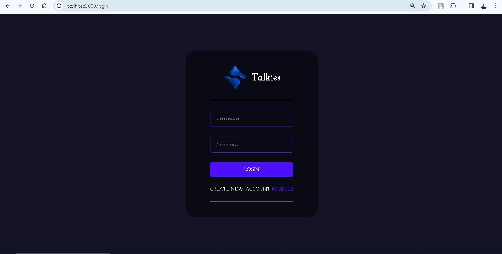
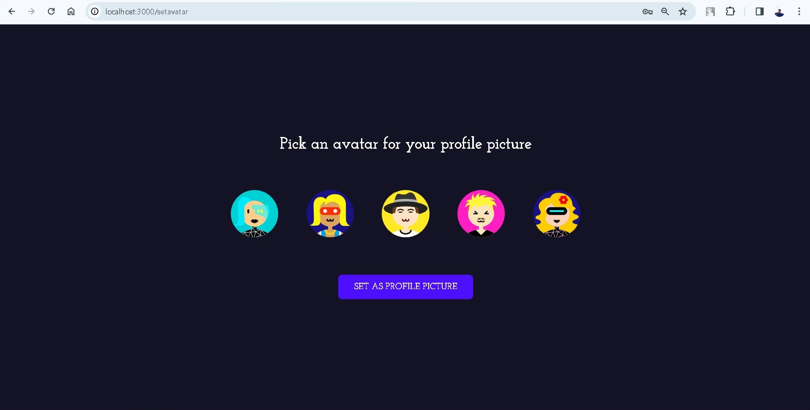
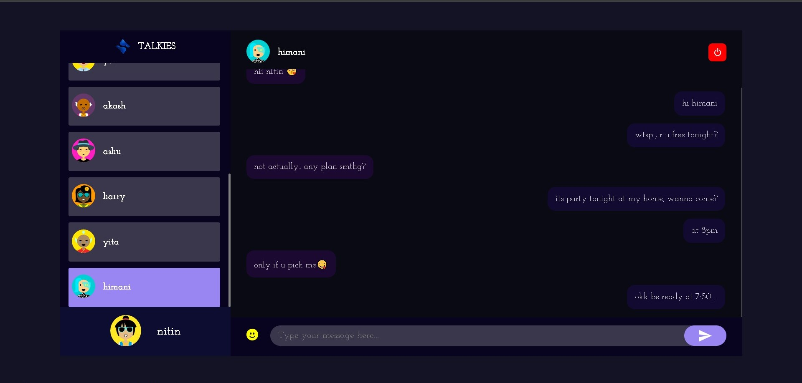

# <a href="https://chat-gk.netlify.app/" target="_blank" >QuoteApp</a>🚀

Talkies is a real-time chat application website built using the MERN stack (MongoDB, Express.js, React.js, Node.js) with Socket.io for real-time communication. It features a stylish and interactive interface where users can chat with each other online in real-time.

## Technologies Used 💻

- MongoDB: A NoSQL database used to store chat messages and user data.
- Express.js: A web application framework for Node.js used to build the server-side API.
- React.js: A JavaScript library used for building the user interface of the chat application.
- Node.js: A JavaScript runtime used for running the server-side code.
- Socket.io: A library that enables real-time, bidirectional communication between web clients and servers.
- Styled Components: A CSS-in-JS library used for styling React components.

## Features 🌟

- Real-time chat functionality using Socket.io.
- Stylish and interactive user interface.
- User authentication and authorization.
- Ability to send and receive messages in real-time.
- User-friendly and intuitive design.

## Screenshots 📷

<!-- Include screenshots of your application here -->





## Getting Started 🚀

Follow these steps to get the Let's Chat project up and running on your local machine:

1. Clone the repository:

   ```bash
   git clone https://github.com/kumarguddu609/let-s-chat.git

   ```

2. Navigate to the server directory and install dependencies:

   ```bash
   cd server
   npm install
   nodemon index.js

   ```

3. Navigate to the Client directory and install dependencies
   ```bash
   cd client
   npm install
   npm start
   ```

Open your browser and go to http://localhost:3000 to view the Let's Chat application.
